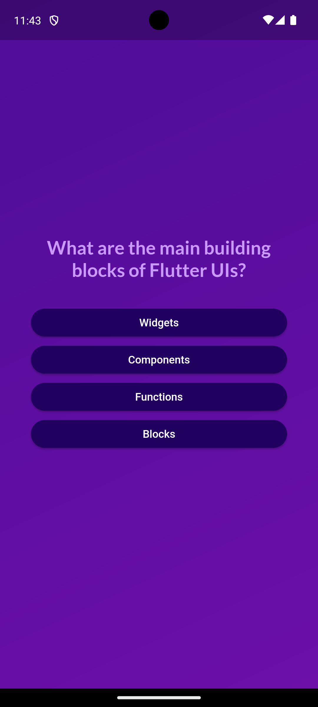

# Quiz App

Quiz App is a fun Flutter app with a bit more logic than the Dice Roller app I coded before. It is perfect to show multiple screens, some data structuring and ask yourself some basic questions about Flutter on the go! This code was produced during the completion of the Flutter course [A Complete Guide to the Flutter SDK & Flutter Framework for building native iOS and Android apps](https://www.udemy.com/course/learn-flutter-dart-to-build-ios-android-apps/learn/lecture/37130436#overview).

## Basic functionality
    
- Carefully designed UI with different fonts, logos, colors and buttons.
- Tap "start quiz" to start the quiz.
- Question with randomly shuffled answers.
- Navigate to the next question every time you give an answer. 
- Result Screen with a Scroll view about given and correct answers, total score and a button to restart the quiz.

## Screenshots and gifs

### The start screen

  

### An example Question

  

### The results screen

  

### Example walkthrough

  

## Topics covered

There are even more principles and basic topics that I learned while programming this app. These include:

1. Used the knowledge we gained during our Dice Roller App (main function as entry point, using runApp to pass the widget tree, etc...).
2. Building and using multiple widgets.
3. Passing Data between widgets.
4. Navigating between screens.
5. Accepting and using functions as input values. 
6. Using conditions to output conditional content.
7. Learned about if statements, ternary expressions and managing Widgets with conditions.
8. Learned about loops in dart and how to combine them with maps.
9. Got to know a few new widgets like the SingleChildScrollView Widget.
10. Got to know new styling options like the shape option for elevated buttons.
11. Used classes on top of stateful and stateless widgets. 
12. Learned about methods used to manipulate or analyze lists in dart.
13. Learned about the spread operator used to pull elements out of a list and add them as stand alone items to a surrounding list.